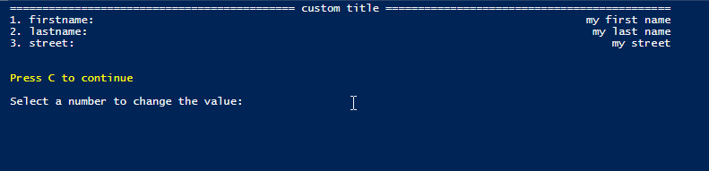
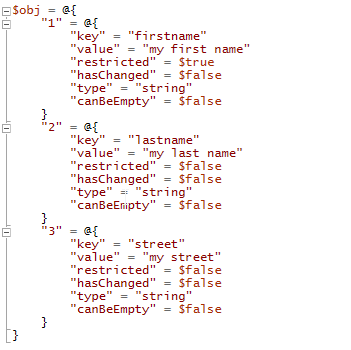
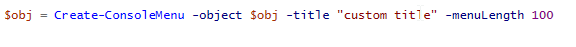
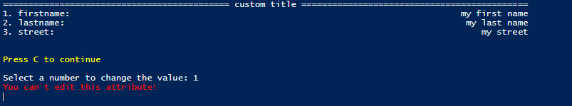
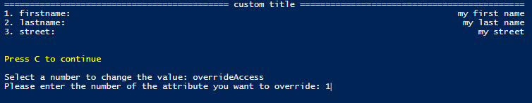
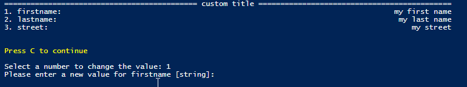

# PowerShellConsoleMenu

Simple menu in the console window

Created from a hashtable

"restricted" defines if the value of the attribute can be changed
This could be used if e.g. the sAMAccountName for an Active Directory user is generated (combination of first and last name) and should
not be set manually

"hasChanged"
If an attribute is edited it is set to true to check the values after exiting the menu. I used it most of the time in combination
with the "restricted" key

"type"
string, int, bool
After inputting a number e.g. '0001234' and the type is set to "int", it will cut the '000' and only '1234' will be left
Beware

"canBeEmpty"
Self explanatory

1. -object = The created object from above
2. -title = A title
3. -menuLength = The length of the rows as shown in the first screenshot

There are two little implementations to 
1. set the "restricted" tag to true
	--> "overrideAccess"
2. change the value of a "restricted" attribute
	--> "overrideValue"
	
I implemented it because there might be a rare case where you actually want to edit a "restricted" attribute without going into the code
and changing the object

